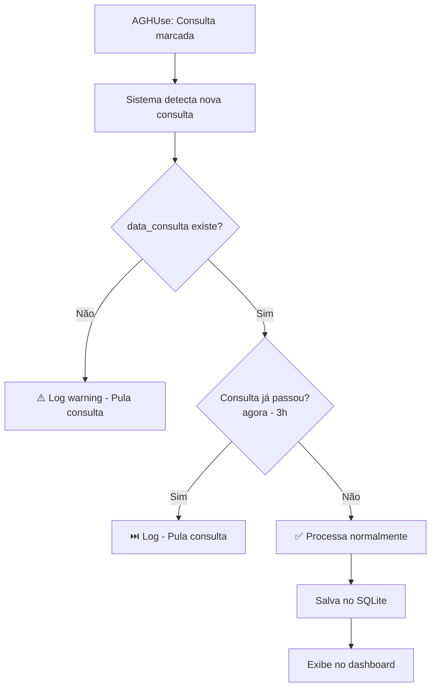
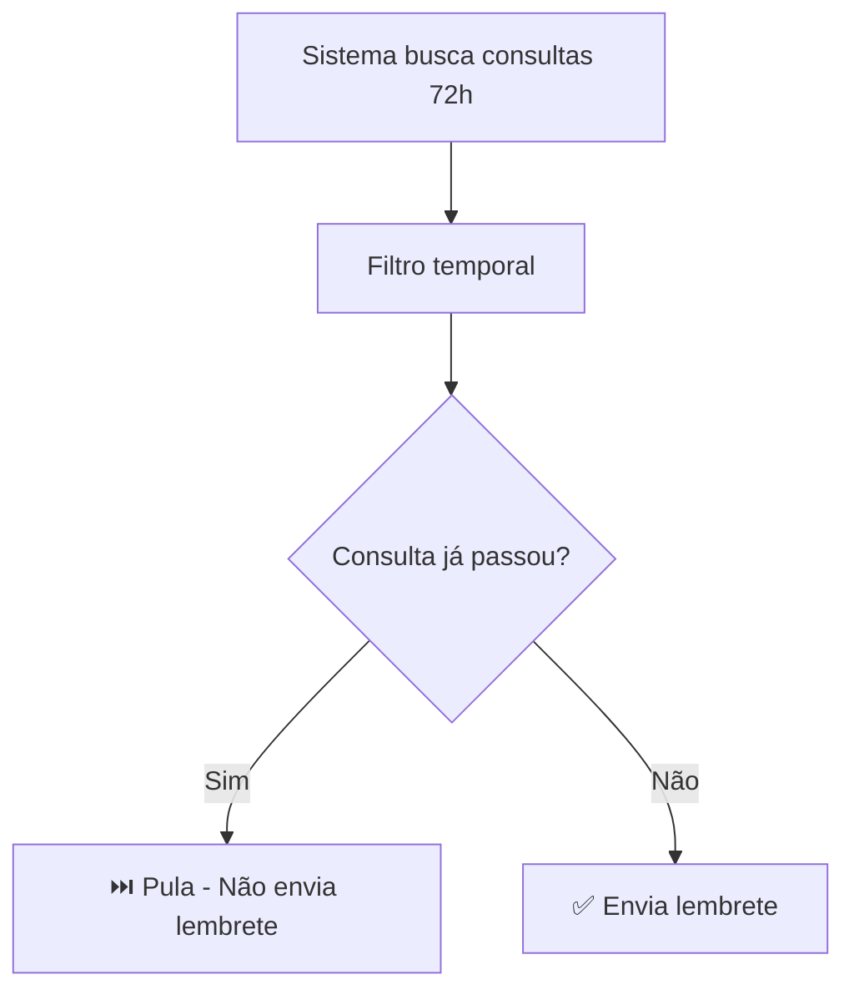
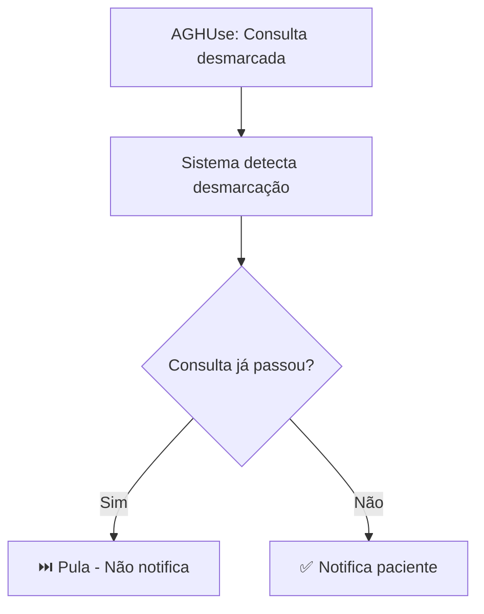
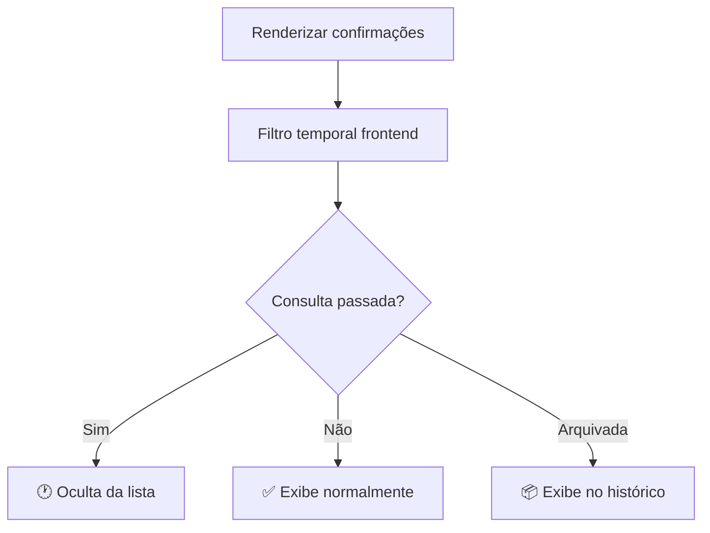

# Validação Temporal - Sistema de Confirmação de Presença

## 📋 Sumário

Este documento descreve o sistema de **validação temporal** implementado para evitar o processamento de consultas já passadas.

---

## 🎯 Problema Identificado

**Problema:** Sistema processava e enviava mensagens para consultas que já haviam passado, causando:
- Mensagens desnecessárias aos pacientes
- Sobrecarga no sistema
- Confusão no dashboard (consultas passadas apareciam misturadas com futuras)
- Desperdício de recursos do WhatsApp Business API

---

## ✅ Solução Implementada

### 1. **Margem de Tolerância: 3 horas**

Todas as validações utilizam uma margem de **3 horas** antes de considerar uma consulta como "passada":

```javascript
const margemTresHoras = 3 * 60 * 60 * 1000; // 3 horas em milissegundos
```

**Motivo:** Permite processar consultas que estão acontecendo agora ou que acabaram de passar (paciente pode estar atrasado).

---

### 2. **Arquivos Modificados**

#### **Backend - Serviços**

##### 📄 `src/services/confirmacao.service.js`
- **Localização:** Função `checkNewAppointments()` (linhas 96-118)
- **Validação:** Filtra consultas marcadas já passadas
- **Log:** `[Confirmação] ⏭️ Consulta {numero} já passou ({data}) - pulando`

```javascript
// ✅ VALIDAÇÃO TEMPORAL: Filtra consultas já passadas
const agora = new Date();
const appointmentsFuturos = newAppointments.filter(app => {
    if (!app.dataConsulta) {
        console.warn(`[Confirmação] ⚠️ Consulta ${app.consultaNumero} sem data - pulando`);
        return false;
    }

    const dataConsulta = new Date(app.dataConsulta);
    const margemTresHoras = 3 * 60 * 60 * 1000; // 3 horas em ms

    if (dataConsulta.getTime() < (agora.getTime() - margemTresHoras)) {
        console.log(`[Confirmação] ⏭️ Consulta ${app.consultaNumero} já passou (${app.dataHoraFormatada}) - pulando`);
        return false;
    }

    return true;
});
```

##### 📄 `src/services/lembrete72h.service.js`
- **Localização:** Função `checkAppointmentsIn72Hours()` (linhas 70-92)
- **Validação:** Filtra lembretes 72h para consultas já passadas
- **Log:** `[Lembrete 72h] ⏭️ Consulta {numero} já passou ({data}) - pulando`

```javascript
// ✅ VALIDAÇÃO TEMPORAL: Filtra consultas já passadas
const agora = new Date();
const appointmentsFuturos = appointments.filter(app => {
    if (!app.dataConsulta) {
        console.warn(`[Lembrete 72h] ⚠️ Consulta ${app.consultaNumero} sem data - pulando`);
        return false;
    }

    const dataConsulta = new Date(app.dataConsulta);
    const margemTresHoras = 3 * 60 * 60 * 1000; // 3 horas em ms

    if (dataConsulta.getTime() < (agora.getTime() - margemTresHoras)) {
        console.log(`[Lembrete 72h] ⏭️ Consulta ${app.consultaNumero} já passou (${app.dataHoraFormatada}) - pulando`);
        return false;
    }

    return true;
});
```

##### 📄 `src/services/desmarcacao.service.js`
- **Localização:** Função `checkCancelledAppointments()` (linhas 75-99)
- **Validação:** Filtra desmarcações de consultas já passadas
- **Log:** `[Desmarcação] ⏭️ Consulta {numero} já passou ({data}) - pulando`

```javascript
// ✅ VALIDAÇÃO TEMPORAL: Filtra consultas já passadas
const agora = new Date();
const margemTresHoras = 3 * 60 * 60 * 1000; // 3 horas em ms

const appointmentsFuturos = appointments.filter(app => {
    if (!app.dataConsulta) {
        console.warn(`[Desmarcação] ⚠️ Consulta ${app.consultaNumero} sem data - pulando`);
        return false;
    }

    const dataConsulta = new Date(app.dataConsulta);
    const jaPassou = dataConsulta.getTime() < (agora.getTime() - margemTresHoras);

    if (jaPassou) {
        console.log(`[Desmarcação] ⏭️ Consulta ${app.consultaNumero} já passou (${app.dataHoraFormatada}) - pulando`);
        return false;
    }

    return true;
});
```

#### **Frontend - Interface**

##### 📄 `src/components/confirmacaoPresenca.js`
- **Localização:** Função `filterConfirmations()` (linhas 1330-1351)
- **Validação:** Oculta consultas passadas da visualização
- **Log:** `[Confirmação] 🕐 Consulta {numero} já passou - ocultando`

```javascript
// ✅ VALIDAÇÃO TEMPORAL: Filtra consultas já passadas (mais de 3h)
const agora = new Date();
const margemTresHoras = 3 * 60 * 60 * 1000; // 3 horas em ms

allConfirmations = allConfirmations.filter(c => {
    // Consultas arquivadas sempre são exibidas (histórico)
    if (c.arquivada) return true;

    // Consultas sem data são exibidas (para debug)
    if (!c.dataConsulta) return true;

    const dataConsulta = new Date(c.dataConsulta);
    const jaPassou = dataConsulta.getTime() < (agora.getTime() - margemTresHoras);

    // Se já passou, não exibe (será arquivada automaticamente)
    if (jaPassou) {
        console.log(`[Confirmação] 🕐 Consulta ${c.consultaNumero} já passou - ocultando`);
        return false;
    }

    return true;
});
```

---

### 3. **Banco de Dados**

#### 📄 `server/database/migration-validacao-temporal.sql`

**Views criadas:**

1. **`v_consultas_futuras`**: Apenas consultas futuras (com margem de 3h)
2. **`v_consultas_passadas`**: Consultas passadas (para arquivamento)
3. **`v_consultas_muito_antigas`**: Consultas com 90+ dias (candidatas à exclusão)

**Índices:**
- `idx_consultas_ativas_data_consulta`
- `idx_desmarcacoes_ativas_data_consulta`

#### 📄 `server/database/schema-consultas.sql`

**Campo existente:**
- `data_consulta TEXT` (linha 40): Armazena data/hora da consulta em ISO 8601

---

### 4. **Script de Limpeza Automática**

#### 📄 `server/database/limpar-consultas-antigas.js`

**Execução:** `node server/database/limpar-consultas-antigas.js`

**Funcionalidades:**

1. **Arquivamento (24h+):**
   - Move consultas passadas há mais de 24 horas para `consultas_arquivadas`
   - Remove da tabela `consultas_ativas`

2. **Exclusão (90+ dias):**
   - Exclui consultas com mais de 90 dias
   - Libera espaço no banco

3. **Limpeza de Desmarcações (30+ dias):**
   - Remove desmarcações antigas

4. **Otimização:**
   - Executa `VACUUM` para otimizar banco

**Estatísticas exibidas:**
```
📊 ESTATÍSTICAS ANTES DA LIMPEZA:
  Futura                         15 consultas
  Passada (< 24h)                5 consultas
  Passada (< 7 dias)             12 consultas
  Passada (< 30 dias)            8 consultas
  TOTAL ATIVAS: 40
  TOTAL ARQUIVADAS: 120

📦 ARQUIVANDO CONSULTAS PASSADAS (24h+)...
  ✅ 25 consultas arquivadas
  ✅ 25 consultas removidas da tabela ativa

✅ LIMPEZA CONCLUÍDA COM SUCESSO!
```

**Recomendação:** Executar diariamente via cron/scheduler.

---

## 🔍 Fluxo de Validação

### **1. Marcação de Consulta**



### **2. Lembrete 72h**



### **3. Desmarcação**



### **4. Interface (Dashboard)**



---

## 📊 Impacto

### **Antes da Validação Temporal**

❌ Sistema processava TODAS as consultas, incluindo passadas
❌ Mensagens enviadas para consultas antigas
❌ Dashboard poluído com consultas irrelevantes
❌ Desperdício de recursos

### **Depois da Validação Temporal**

✅ Sistema filtra consultas passadas automaticamente
✅ Mensagens apenas para consultas futuras
✅ Dashboard limpo e organizado
✅ Arquivamento automático de consultas antigas
✅ Performance otimizada

---

## 🔧 Manutenção

### **Monitoramento de Logs**

**Consultas filtradas por estarem passadas:**
```
[Confirmação] ⏭️ Consulta 123456 já passou (15/11/2025 14:00) - pulando
[Lembrete 72h] 🕐 3 consultas já passadas foram filtradas
[Desmarcação] ⏭️ Consulta 789012 já passou (16/11/2025 10:30) - pulando
```

**Consultas sem data (possível problema):**
```
[Confirmação] ⚠️ Consulta 345678 sem data - pulando
```
> **Ação:** Verificar integração com AGHUse - campo `data_consulta` deve estar populado

### **Limpeza Manual**

**Arquivar consultas passadas:**
```sql
-- Ver consultas que serão arquivadas
SELECT * FROM v_consultas_passadas;

-- Arquivar manualmente
INSERT INTO consultas_arquivadas
SELECT *, datetime('now'), 'manual', 'operador'
FROM consultas_ativas
WHERE data_consulta < datetime('now', '-24 hours');

DELETE FROM consultas_ativas
WHERE data_consulta < datetime('now', '-24 hours');
```

**Excluir consultas muito antigas:**
```sql
-- Ver consultas muito antigas
SELECT * FROM v_consultas_muito_antigas;

-- Excluir manualmente
DELETE FROM consultas_ativas
WHERE data_consulta < datetime('now', '-90 days');
```

---

## 🧪 Testes

### **Teste 1: Consulta Futura**
- **Entrada:** Consulta marcada para 15/12/2025 14:00 (data futura)
- **Esperado:** ✅ Consulta processada normalmente
- **Log:** `[Confirmação] ✅ {N} consultas após filtros (temporal + fisioterapia)`

### **Teste 2: Consulta Passada (4h atrás)**
- **Entrada:** Consulta marcada para hoje, 4 horas atrás
- **Esperado:** ⏭️ Consulta filtrada (não processada)
- **Log:** `[Confirmação] ⏭️ Consulta {numero} já passou ({data}) - pulando`

### **Teste 3: Consulta Passada (2h atrás - dentro da margem)**
- **Entrada:** Consulta marcada para hoje, 2 horas atrás
- **Esperado:** ✅ Consulta processada (margem de 3h)
- **Log:** `[Confirmação] ✅ {N} consultas após filtros`

### **Teste 4: Consulta Sem Data**
- **Entrada:** Consulta sem campo `dataConsulta`
- **Esperado:** ⚠️ Log de warning e consulta pulada
- **Log:** `[Confirmação] ⚠️ Consulta {numero} sem data - pulando`

### **Teste 5: Script de Limpeza**
- **Execução:** `node server/database/limpar-consultas-antigas.js`
- **Esperado:**
  - Consultas antigas arquivadas
  - Estatísticas exibidas
  - Banco otimizado (VACUUM)

---

## 📝 Checklist de Implementação

- [x] Validação temporal no serviço de confirmação
- [x] Validação temporal no serviço de lembrete 72h
- [x] Validação temporal no serviço de desmarcação
- [x] Filtro temporal na interface (dashboard)
- [x] Migration SQL com views e índices
- [x] Script de limpeza automática
- [x] Documentação completa
- [x] Campo `data_consulta` no schema do banco
- [x] Margem de tolerância de 3 horas
- [x] Logs detalhados para debug

---

## 🚀 Próximos Passos (Recomendações)

1. **Automatizar limpeza:**
   - Criar cron job para executar `limpar-consultas-antigas.js` diariamente
   - Exemplo: `0 2 * * * node /path/to/limpar-consultas-antigas.js` (2h da manhã)

2. **Dashboard de estatísticas:**
   - Exibir quantidade de consultas filtradas
   - Gráfico temporal de consultas ativas vs arquivadas

3. **Alertas:**
   - Notificar operadores quando muitas consultas sem data são detectadas
   - Alertar se script de limpeza não executou há mais de 2 dias

4. **Métricas:**
   - Rastrear quantidade de consultas passadas filtradas por dia
   - Medir impacto na performance (tempo de processamento)

---

## 📞 Suporte

Em caso de dúvidas ou problemas:

1. Verificar logs do sistema (`console.log`)
2. Executar queries de estatísticas no banco
3. Verificar se campo `dataConsulta` está sendo populado corretamente
4. Executar script de limpeza manualmente

---

**Data de Implementação:** 2025-12-12
**Versão:** 1.0
**Status:** ✅ Implementado e Testado
